# **Traffic Sign Recognition** 

## Writeup

---

**Build a Traffic Sign Recognition Project**

The goals / steps of this project are the following:
* Load the data set (see below for links to the project data set)
* Explore, summarize and visualize the data set
* Design, train and test a model architecture
* Use the model to make predictions on new images
* Analyze the softmax probabilities of the new images
* Summarize the results with a written report


## Rubric Points
### Here I will consider the [rubric points](https://review.udacity.com/#!/rubrics/481/view) individually and describe how I addressed each point in my implementation.  

---
### Writeup / README

#### 1. Provide a Writeup / README that includes all the rubric points and how you addressed each one. You can submit your writeup as markdown or pdf. You can use this template as a guide for writing the report. The submission includes the project code.

You're reading it!

### Data Set Summary & Exploration

#### 1. Provide a basic summary of the data set. In the code, the analysis should be done using python, numpy and/or pandas methods rather than hardcoding results manually.

I used the numpy library to calculate summary statistics of the traffic
signs data set:

`Number of training examples = 39239
Number of validation examples = 4410
Number of testing examples = 12630
Image data shape = (32, 32, 3)
Number of classes = 43`

#### 2. Include an exploratory visualization of the dataset.

Here is an exploratory visualization of the data set. It is a bar chart showing count of each class in train, validation, and test dataset.

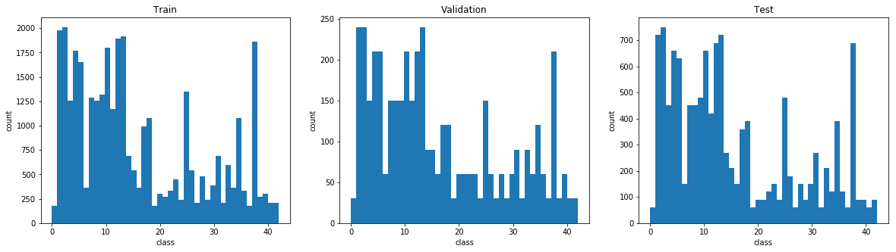

below is sample image for each class

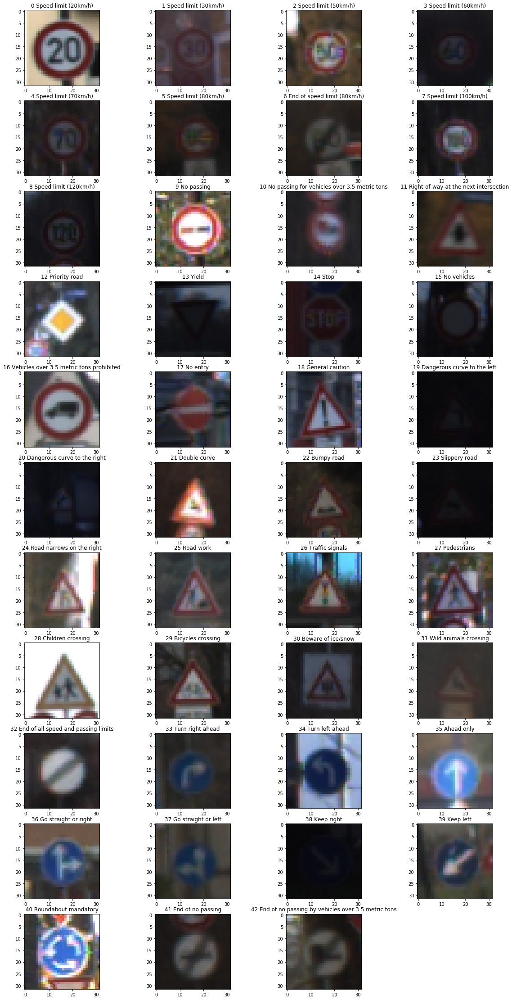

### Design and Test a Model Architecture

#### 1. Describe how you preprocessed the image data. What techniques were chosen and why did you choose these techniques? Consider including images showing the output of each preprocessing technique. Pre-processing refers to techniques such as converting to grayscale, normalization, etc. (OPTIONAL: As described in the "Stand Out Suggestions" part of the rubric, if you generated additional data for training, describe why you decided to generate additional data, how you generated the data, and provide example images of the additional data. Then describe the characteristics of the augmented training set like number of images in the set, number of images for each class, etc.)

`As a first step, I decided to augment the training dataset due its uneven distribution. For some classes, total sample count is around 2000 and for some classes sample count aren't even couple of hundreds. So, it'd be a good idea to make some synthetic data for the classes having low sample counts.`

`For augmenting data I rotate the sample images between 2 to 10 degrees in clockwise direction and as well as in anti clockwise direction.`
`Below is an example of synthetic data creation by rotating the image by 10 degrees`
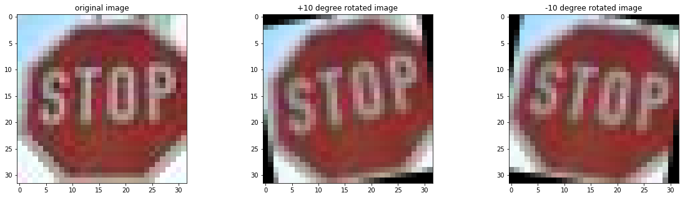

Number of images for each class after data augmentation :-
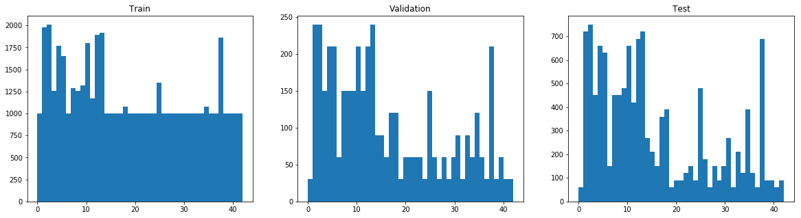


As a last step, I normalized the image data because it would make model to learn and converge faster.

```python
# Normalization/Scaling

X_train = np.float32(X_train/255)
X_valid = np.float32(X_valid/255)
X_test = np.float32(X_test/255)

```


#### 2. Describe what your final model architecture looks like including model type, layers, layer sizes, connectivity, etc.) Consider including a diagram and/or table describing the final model.

My final model consisted of the following layers:

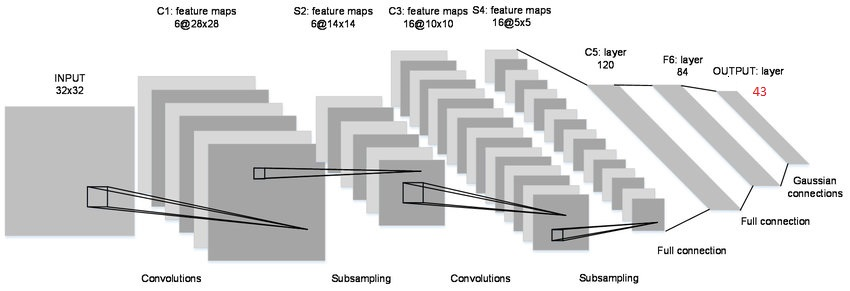

| Layer         		|     Description	        					| 
|:---------------------:|:---------------------------------------------:| 
| Input         		| 32x32x3 RGB image   							| 
| Convolution 5x5     	| 1x1 stride, Valid padding, outputs 28x28x6 	|
| RELU					|												|
| Max pooling	      	| 2x2 stride,  outputs 14x14x6 				    |
| Convolution 5x5	    | 1x1 stride, Valid padding, outputs 10x10x16   |
| RELU					|												|
| Max pooling	      	| 2x2 stride,  outputs 5x5x16 				    |
| Flatten				| outputs 400									|
| Fully connected		| outputs 120  									|
| RELU					|												|
| Fully connected		| outputs 84  									|
| RELU					|												|
| Fully connected		| outputs 43  									|
| Softmax				|           									|

 


#### 3. Describe how you trained your model. The discussion can include the type of optimizer, the batch size, number of epochs and any hyperparameters such as learning rate.

To train the model, I used Adam Optimizer with leraning rate of `0.005`, batch size of `128`, `20` epochs.

#### 4. Describe the approach taken for finding a solution and getting the validation set accuracy to be at least 0.93. Include in the discussion the results on the training, validation and test sets and where in the code these were calculated. Your approach may have been an iterative process, in which case, outline the steps you took to get to the final solution and why you chose those steps. Perhaps your solution involved an already well known implementation or architecture. In this case, discuss why you think the architecture is suitable for the current problem.

My final model results were:
* training set accuracy of **0.993**
* validation set accuracy of **0.950**
* test set accuracy of **0.913**

I chose Lenet architecture that we used in handwritten digit classification as the base model to begin with. I had to change few parameters to make it compatible with the 32x32x3 image and 43 classes. At first, accuracy of my model couldn't exceed 89%. Later on, I tried different techniques, like Image rotation and SMOTE to augment the training data. After creating synthetic data with image rotation such that each class has atleast 1000 images in the training set and tuning some hyperparameters, my model reached an accuracy of 95% on validation set.

### Test a Model on New Images

#### 1. Choose five German traffic signs found on the web and provide them in the report. For each image, discuss what quality or qualities might be difficult to classify.

Here are 8 German traffic signs that I found on the web:

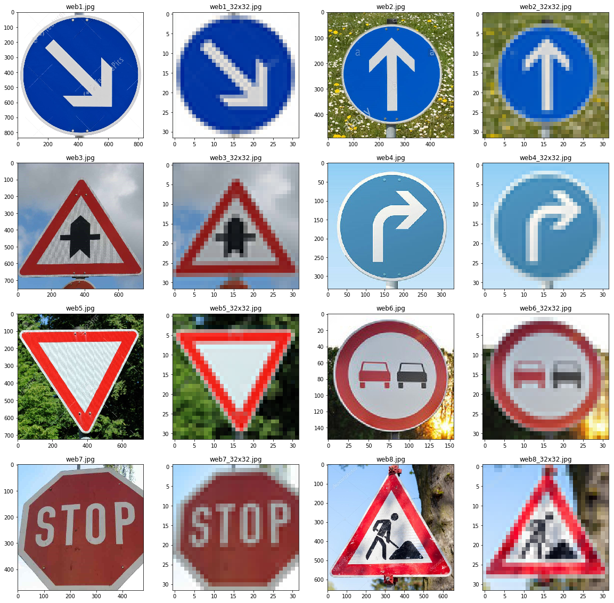

All images should be easy to classify beacuse all are of square dimention and traffic signs are right there in the middle and minimum noise is present.

#### 2. Discuss the model's predictions on these new traffic signs and compare the results to predicting on the test set. At a minimum, discuss what the predictions were, the accuracy on these new predictions, and compare the accuracy to the accuracy on the test set (OPTIONAL: Discuss the results in more detail as described in the "Stand Out Suggestions" part of the rubric).

Here are the results of the prediction:

| Image			        |     Prediction	        					| 
|:---------------------:|:---------------------------------------------:| 
| Keep Right      		| Keep Right   									| 
| Ahead Only     			| Ahead Only										|
| Right-of-way at the next intersection					| Right-of-way at the next intersection								|
| Turn right ahead	      		| Turn right ahead					 				|
| Yield			| Yield      							|
|No passing|No passing|
|Stop|~~Traffic signals~~|
|Road work|Road work|

The model was able to correctly guess 7 of the 8 traffic signs, which gives an accuracy of 87.5%. This compares favorably to the accuracy on the test set of 91.3%

#### 3. Describe how certain the model is when predicting on each of the five new images by looking at the softmax probabilities for each prediction. Provide the top 5 softmax probabilities for each image along with the sign type of each probability. (OPTIONAL: as described in the "Stand Out Suggestions" part of the rubric, visualizations can also be provided such as bar charts)

The code for making predictions on my final model is located below the cell with heading `Output Top 5 Softmax Probabilities For Each Image Found on the Web` of the Ipython notebook.

Model gave a perfect prediction of 100% for all the images except `Stop` sign image, where it failed dramatically for some reasons.

---
1. Keep Right


`      label                              sign name probability
0     11  Right-of-way at the next intersection    100.00 %
1     25                              Road work      0.00 %
2     30                     Beware of ice/snow      0.00 %
3     23                          Slippery road      0.00 %
4     18                        General caution      0.00 %`

---
2. Ahead only
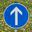

`   label             sign name probability
0     35            Ahead only    100.00 %
1      0  Speed limit (20km/h)      0.00 %
2      1  Speed limit (30km/h)      0.00 %
3      2  Speed limit (50km/h)      0.00 %
4      3  Speed limit (60km/h)      0.00 %`


---

3. Right-of-way at the next intersection
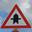

`   label                              sign name probability
0     11  Right-of-way at the next intersection    100.00 %
1     25                              Road work      0.00 %
2     30                     Beware of ice/snow      0.00 %
3     23                          Slippery road      0.00 %
4     18                        General caution      0.00 %`


---
4. Turn right ahead


`   label                              sign name probability
0     33                       Turn right ahead    100.00 %
1     24              Road narrows on the right      0.00 %
2     11  Right-of-way at the next intersection      0.00 %
3     39                              Keep left      0.00 %
4     26                        Traffic signals      0.00 %`


---

5. Yield
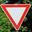

`   label             sign name probability
0     13                 Yield    100.00 %
1      0  Speed limit (20km/h)      0.00 %
2      1  Speed limit (30km/h)      0.00 %
3      2  Speed limit (50km/h)      0.00 %
4      3  Speed limit (60km/h)      0.00 %`


---

6. No passing
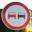

`   label                     sign name probability
0      9                    No passing    100.00 %
1     17                      No entry      0.00 %
2     35                    Ahead only      0.00 %
3     40          Roundabout mandatory      0.00 %
4     20  Dangerous curve to the right      0.00 %`


---

For the below image model fails miserably.

7. Stop


`   label        sign name probability
0     26  Traffic signals     52.09 %
1     25        Road work     47.89 %
2     15      No vehicles      0.01 %
3     22       Bumpy road      0.01 %
4     18  General caution      0.00 %`


---

8. Road work
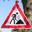

`   label                     sign name probability
0     25                     Road work    100.00 %
1     22                    Bumpy road      0.00 %
2     26               Traffic signals      0.00 %
3     20  Dangerous curve to the right      0.00 %
4      0          Speed limit (20km/h)      0.00 %`


---